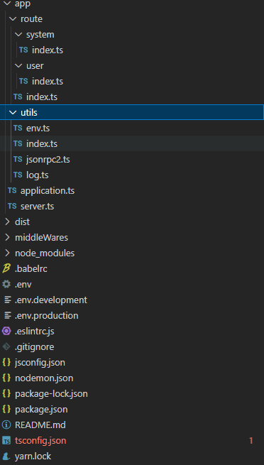

Koa 是一种简单好用的 Web 框架。它的特点是优雅、简洁、表达力强、自由度高，

缺点 就是太过自由，并没有内置过多的功能，比如常见的请求体解析、路由、模板渲染等功能都没有，需要加载第三方中间件来实现。另外 Koa  **只支持 Http 服务** ，无法满足业务方对于 RPC 服务的需求。

#### npm init

#### npm install koa

#### add 标签

scripts": {

    "dev": "node server"

  },

#### 初始：配置环境变量

```
"scripts": {   
 "dev": "set NODE_MODE_ENV=development && node server",    "start": "set NODE_MODE_ENV=production && node server"  },
```

> 或者安装  **dotenv** 读取配置文件

#### 1、添加utils   查询ip服务获取快速访问链接(通过os系统模块)

#### 2、通过端口监听回调处理端口占用情况(通过 net 系统模块)

#### 3、别名定义 安装 ：module-alias  包

* package.json 添加

  "_moduleAliases": {

  "@": "./"

  }
* 服务启动入口添加  ：require('module-alias/register')
* 保证vscode 能点击跳转 根目录创建 jsconfig.json 添加代码

```
{
    "compilerOptions": {
        "target": "ES6",
        "module": "commonjs",
        "allowSyntheticDefaultImports": true,
        "baseUrl": "./",
        "paths": {
          "@*": ["/*"]
        }
    },
    "exclude": [
        "node_modules"
    ]
}
```

* ts 路由映射 tsconfig.json

```
"compilerOptions":{      "path"：{            "@/": "./"
      }}
```

#### 4、方便调试安装 **nodemon**  自动重启服务

    npm install -g nodemon

   修改启动命令

   "dev": "set NODE_MODE_ENV=development &&  nodemon  server",

    "start": "set NODE_MODE_ENV=production && nodemon server"

    命令窗口  restartable：重启的命令，默认是 rs

#### 5、 支持TypeScript

   1  安装  @types/koa  typescript  @types/node ts-node

    @types/module-alias
   2  创建   typescript.json  或者  npx tsc --init

```
{

    "compilerOptions": {"skipLibCheck": true, 
    "target": "es2016", 

    "module": "commonjs",

    "esModuleInterop": true,

    "forceConsistentCasingInFileNames": true,

    "strict": true,  "rootDir": "./",

    "paths": {

    "@/*": [

    "app/*"

    ]

    },

    "typeRoots": [

    "./node_modules/@types"

    ],

    "types": [

    "module-alias",

    ],

  },

  "exclude": [

    "node_modules"

  ]

}
```

3.修改启动命令

```
  "scripts": {
    "dev": "set NODE_MODE_ENV=development && nodemon --ext js,ts --exec npm run start",
    "start": "ts-node ./app/server.ts"
  },
```

##### @ts 不读取  tsconfig.json 文件时终端运行报错  可尝试添加--files 修复  ts-node --files ./app/server.ts"

#### 6、中间件处理

##### 1、路由中间件处理

```
npm install --save @koa/router koa-compose
npm install --save-dev @types/koa__router
```

 创建路由文件    route/index.js     //koa-router 基本使用

```基本使用


// 先后设置两个中间件
router
  .use(session())
  .use(authorize());
const Koa = require('koa'); // 引入koa
const Router = require('koa-router'); // 引入koa-router

const app = new Koa(); // 创建koa应用
const router = new Router(); // 创建路由，支持传递参数

// 指定一个url匹配
router.get('/', async (ctx) => {
    ctx.type = 'html';
    ctx.body = '<h1>hello world!</h1>';
})

// 调用router.routes()来组装匹配好的路由，返回一个合并好的中间件
// 调用router.allowedMethods()获得一个中间件，当发送了不符合的请求时，会返回 `405 Method Not Allowed` 或 `501 Not Implemented`
app.use(router.routes());
app.use(router.allowedMethods({ 
    // throw: true, // 抛出错误，代替设置响应头状态
    // notImplemented: () => '不支持当前请求所需要的功能',
    // methodNotAllowed: () => '不支持的请求方式'
}));

// 启动服务监听本地3000端口
app.listen(3000, () => {
    console.log('应用已经启动，http://localhost:3000');
})
```

`router.prefix(prefix)` 来设置路由的前缀，也可以通过实例化路由的时候传递参数设置路由的前缀，比如在 RESTful 接口里面，往往会为接口设置一个 `api` 前缀，如：

```
router.prefix('/api')

// 或者
const router = new Router({
   prefix: '/api' 
})
```

##### 2、路由嵌套配置

```
import Router from "@koa/router";
var userRouter = new Router();

userRouter.get('/', (ctx: any) => {
    ctx.body = {
        code: 200,
        message: "success",
        data: { code: 'user' }
    }
});

export default userRouter
const forums = new KoaRouter();
forums.use('/use', userRouter.routes())
```

##### 3、路由配置完成 绑定到app上

   app.use(forums.routes()).use(forums.allowedMethods())

   //forums.routes()  使用些路由   forums.allowedMethods()

  //处理处理 options请求，`allowedMethods`处理的业务是当所有路由中间件执行完成之后,若 `ctx.status`为空或者404的时候,丰富 `response`对象的 `header`头.

// koa-compose 则是将 koa/koa-router 各个中间件合并执行

 http       通过控制端口提供不同服务

##### 4、自动读取文件挂载

```
   const routerList: any[] = [];
    const instance: Record<string, any> = {};
    // console.log(path.resolve('app/route'));//获取绝对路径  'D:\Project\USafe\koa\app\route'
    const routesDir = fs.readdirSync(path.resolve('app/route')).filter((item: string) => item);//[xx,xx,xx] 文件路由目录
    routesDir.forEach((dirPath: string) => {
        if (dirPath.split('.').length < 2) {//忽略手动挂暂文件
            const routesFiles = fs.readdirSync(path.resolve(path.resolve(`app/route/${dirPath}`))).filter((item: string) => item);//获取二级路由
            routesFiles.forEach((filePath: string) => {
                instance[dirPath] = new KoaRouter({ prefix: `/web/api` }); //设置 路由前缀
                instance[dirPath].use(require(path.resolve(`app/route/${dirPath}/${filePath}`)).default.routes());
            });
            routerList.push(instance[dirPath].routes());
            return
        }
    });
    const setup = KoaCompose([...routerList])
    app.use(setup)
```

目录结构


#### 7、日志工具

```
npm install --save log4js koa-logger
```

* 日志分级  //日志重要程度  logger.【级别】()  例如  info ，debug,error等log4js 分9类
* 日志分类  // 日志的类别  区分日志来源于哪个模块
* 日志落盘  // 输出到哪里

  跟多 log4js 信息 查看app/utiles/log  注释信息或者查看官网

```

import log4js from "log4js";
const path = require('path')
//日志根目录
var baseLogPath = 'logS/'

/*报错输出日志*/
//错误日志目录、文件名、输出完整路径
var errorPath = "/error";
var errorFileName = "error";
var errorLogPath = baseLogPath + errorPath + "/" + errorFileName;

/*请求数据得到响应时输出响应日志*/
//响应日志目录、文件名、输出完整路径
var responsePath = "/response";
var responseFileName = "response";
var responseLogPath = baseLogPath + responsePath + "/" + responseFileName;

/*操作数据库进行增删改等敏感操作记录日志*/
//操作日志目录、文件名、输出完整路径
var handlePath = "/handle";
var handleFileName = "handle";
var handleLogPath = baseLogPath + handlePath + "/" + handleFileName;

/*记录所所有请求数据*/
var httpPath = "/http";
var httpFileName = "http";
var httpLogPath = baseLogPath + httpPath + "/" + handleFileName;


const env = String(process.env.NODE_MODE_ENV).replace(/(^\s*)|(\s*$)/g, "")
const logs: any = log4js.getLogger();
logs.level = env == 'development' ? "debug" : '';
// ALL < TRACE < DEBUG < INFO < WARN < ERROR < FATAL < MARK < OFF
logs.pm2 = true // 如果您使用pm2运行您的应用程序，请将此设置为 true ，否则日志将不起作用

log4js.configure({
    appenders: {
        "rule-console": { "type": "console" },
        "errorLogger": {
            "type": "dateFile",
            "filename": errorLogPath,
            "pattern": "-yyyy-MM-dd-hh.log",
            "alwaysIncludePattern": true,
            "encoding": "utf-8",
            "maxLogSize": 1000,
            "numBackups": 3,
            "path": errorPath
        },
        "resLogger": {
            "type": "dateFile",
            "filename": responseLogPath,
            "pattern": "-yyyy-MM-dd-hh.log",
            "alwaysIncludePattern": true,
            "encoding": "utf-8",
            "maxLogSize": 1000,
            "numBackups": 3,
            "path": responsePath
        },
        "handleLogger": {
            "type": "dateFile",
            "filename": handleLogPath,
            "pattern": "-yyyy-MM-dd-hh.log",
            "alwaysIncludePattern": true,
            "encoding": "utf-8",
            "maxLogSize": 1000,
            "numBackups": 3,
            "path": responsePath
        },
        "http": {
            "type": "dateFile",
            "filename": httpFileName,
            "pattern": "-yyyy-MM-dd-hh.log",
            "alwaysIncludePattern": true,
            "encoding": "utf-8",
            "maxLogSize": 1000,
            "numBackups": 3,
            "path": httpLogPath
        },
    },
    categories: {//categories定义了日志输出类别，
        "default": { "appenders": ["rule-console"], "level": "all" },
        "resLogger": { "appenders": ["resLogger"], "level": "info" },
        "errorLogger": { "appenders": ["errorLogger"], "level": "error" },
        "handleLogger": { "appenders": ["handleLogger"], "level": "all" },
        "http": { "appenders": ["http"], "level": "info" }
    },
});


//调用预先定义的日志名称
const resLogger = log4js.getLogger("resLogger");
const errorLogger = log4js.getLogger("errorLogger");
const handleLogger = log4js.getLogger("handleLogger");//操作数据库记录日志
// const httpLogger = log4js.getLogger("http");//操作数据库记录日志
const consoleLogger = log4js.getLogger();

var formatText: any = {
    info: function (info: any) {
        let logText = new String();
        logText += "\n" + "***************info log start ***************" + "\n"; //信息
        logText += "info detail: " + "\n" + JSON.stringify(info) + "\n";        //内容
        logText += "*************** info log end ***************" + "\n";        //日志结束信息
        return logText;
    },
    request: function (req: any, resTime: any) {
        var logText = new String();
        var method = req.method;
        logText += "request method: " + method + "\n";   //访问方法
        logText += "request originalUrl:  " + req.originalUrl + "\n";        //请求原始地址
        logText += "request client ip:  " + req.ip + "\n";//客户端ip
        if (method === 'GET') {        //请求参数
            logText += "request query:  " + JSON.stringify(req.query) + "\n";
        } else {
            logText += "request body: " + "\n" + JSON.stringify(req.body) + "\n";
        }
        //服务器响应时间
        logText += "response time: " + resTime + "\n";
        return logText;
    },
    response: function (ctx: any, resTime: any) {
        let logText = new String();
        logText += "\n" + "*************** response log start 响应日志开始***************" + "\n"; //响应日志开始
        logText += formatText.request(ctx.request, resTime);//添加请求日志
        logText += "response status: " + ctx.status + "\n"; //响应状态码
        logText += "响应内容 response body: " + "\n" + JSON.stringify(ctx.body) + "\n";    //响应内容
        logText += "*************** response log end ***************" + "\n";        //响应日志结束
        return logText;
    },
    handle: function (info: any) {
        let logText = new String();
        logText += "\n" + "***************        //响应日志开始 info log start ***************" + "\n";        //响应日志开始
        logText += "handle info detail: " + "\n" + JSON.stringify(info).replace(/\\n/g, "\n") + "\n";        //响应内容
        logText += "***************     //响应日志结束 info log end ***************" + "\n";     //响应日志结束
        return logText;
    },
    error: function (ctx: any, err: any, resTime: any) {
        let logText = new String();
        logText += "\n" + "*************** error log start ***************" + "\n";    //错误信息开始
        logText += formatText.request(ctx.request, resTime);        //添加请求日志
        logText += "err name: " + err.name + "\n";       //错误名称
        logText += "err message: " + err.message + "\n";    //错误信息
        logText += "err stack: " + err.stack + "\n";   //错误详情
        logText += "*************** error log end ***************" + "\n";        //错误信息结束
        return logText;
    }
}

export const logInfo = (info: any) => {    //封装普通日志
    if (info) {
        consoleLogger.info(formatText.info(info));
    }
}

export const logResponse = function (ctx: any, resTime: any) {    //封装响应日志
    if (ctx) {
        // console.log('response', ctx);
        resLogger.info(formatText.response(ctx, resTime));
    }
}
export const logHandle = function (res: any) {    //封装操作日志
    if (res) {
        handleLogger.info(formatText.handle(res));
    }
}

export const logError = function (ctx: any, error: any, resTime: any) {//封装错误日志
    if (ctx && error) {
        errorLogger.error(formatText.error(ctx, error, resTime));
    }
}
```

#### 8、mysql 使用

###### 1、安装mysql

```
npm install mysql --save
```

###### 2、环境配置文件添加数据库链接信息、 定义连接池 并全局暴露

```
import mysql from 'mysql'
export default mysql.createPool({
    host: database.host,//通过配置项  根据环境连接到数据库
    port: database.port,
    user: database.user,
    password: database.password,
    database: database.database
})


```

###### 3、 编写db 方法

```
import { logHandle } from '@/utils/log'

export const query = (sql: string, values?: any) => {
    return new Promise((resolve, reject) => {
        // console.log('pool', pool);
        pool.getConnection((err: any, connection: any) => {
            if (err) {
                reject(err)
                logHandle(err)
                console.log(err, "数据库连接失败");
                resolve({ code: 500, })
            } else {
                // console.log("数据库连接成功", connection);
                connection.query(sql, values, (err: any, results: any) => {
                    if (err) {
                        reject(err)
                        resolve({ code: 400 })
                    } else {
                        resolve({
                            code: 200,
                            results,
                        })
                        console.log('results', results[0]);

                        connection.release()// 释放连接池
                    }
                    logHandle(err)
                })
            }
        })
    })
}
```

4、定义控制器 controller

```
import { query } from '../db/user/query'

interface UserList {
    page: number
    pageSize: number
    total: number
}

//查询单条详情    分页查询   总条数   
export const queryUser = async (id?: number | string, page?: number | string, pageSize?: number | string) => {
    if (id) return await query(`select * from t_user where id='${id}'`)
    const total: any = await query(`select count(id) from t_user`)
    return await {
        total
    }
}
```

#### 9、sql  语句的简单使用

这里需要注意koa  post 请求是以二进制形式进行网络接受  所以这里需要 使用转义包 koa-bodyparser 详细内容请查看github

https://github.com/koajs/bodyparser/tree/2.x

SQL 分为两个部分：数据操作语言 (DML) 和 数据定义语言 (DDL)。

DDL：

*CREATE DATABASE* - 创建新数据库

*ALTER DATABASE* - 修改数据库

*CREATE TABLE* - 创建新表

*ALTER TABLE* - 变更（改变）数据库表

*DROP TABLE* - 删除表

*CREATE INDEX* - 创建索引（搜索键）

*DROP INDEX* - 删除索引

DML：

*SELECT* - 从数据库表中获取数据   如：select */列名称  from user（表名称）where city='shenzhen'

*UPDATE* - 更新数据库表中的数据  如：update user(表名称）set city='shenzhen' where address='nanshan'

*DELETE* - 从数据库表中删除数据   如：delete from user(表名称）where city='shenzhen'

*INSERT INTO* - 向数据库表中插入数据   如：insert into user(表名称） (city, address) values ('shenzhen', 'nanshan'

简单查询  select * from '表'  where   字段名='关键字'

#### 10、测试框架的搭建(未完成)

#### 11、api 接口文档的编写及类型定义（未完成）

#### 12、jwt 验证添加

#### 13、补充koa post 请求参数解析问题

 需要使用相关中间件处理    koa-bosy / koa-bodyparser

#### 14、docker集成  与PM2
